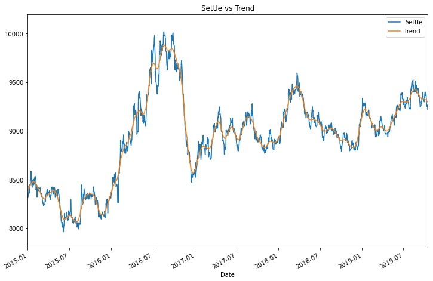
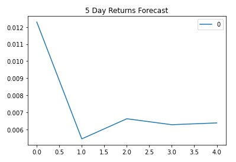
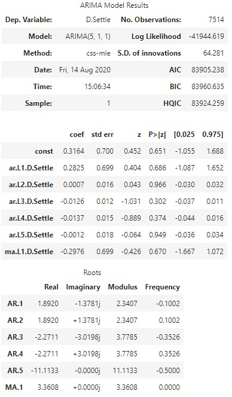
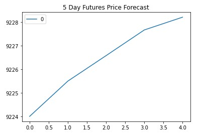
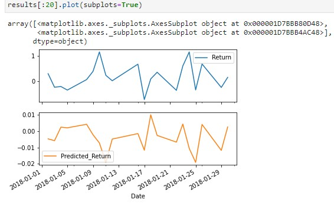

# 10-Time-Series

#### Unit 10 Time-Series Homework - Dan Smith
* Time Series Analysis: [./time_series_analysis.ipynb](./time_series_analysis.ipynb)
* Regression Analysis: [./regression_analysis.ipynb](./regression_analysis.ipynb)

##### Summary: Time-Series Analysis
1. Trend vs Actual Settle
    * Using Hodrick-Prescott filter to separate trend and noise allows comparison of trend vs actual.
    * Zooming in on shorter time periods shows volatility around the trend.
    

2. ARMA Model
    * Used percent change to make the data stationary.
    * Used 2 lags for AR, 1 lag for moving average  (order=(2,1))
    * AIC = 15798.142, BIC = 15832.765
    * p value - 0.421
    
    * ARMA 5-day forecast:
    
    * **Based on p value > 0.05 (0.421), the model is a <ins>NOT</ins> good fit**

3. ARIMA Model
    * ARIMA model used difference as apposed to pct_change used with ARMA above.
    * Used 5 lags for AR, 1 lag for moving average (differs from ARMA above).
    * AIC = 83905.238, BIC = 83960.635  **Indicates a worse fit than ARMA model above.
    * p value - 0.651
    
    * ARIMA 5-day forecast:
    
    * **This model predicst that in the near term, the value of yen will increase in USD.**

##### Summary: Regression Analysis
1. Linear Regression Model overview
    * Lagged returns (days) shifted by one. 
    * Daily train data from 2014 - 2018, Test data included 2018
    * Predicted returns showed a very similar pattern, though values were very different between predictions and actual
    

2. Out-of-Sample Performance
    * out-of-sample Root Mean Squared error (RMSE): 0.41367669313524336

3. In-Sample Performance
    * in sample RMSE: 0.565021989417302

4. Performance out-of-sample vs in-sample
    * In-sample root mean squared error (RMSE) is ~0.57 and Out-of-sample RMSE is ~0.41.
    * Base on above, this model performs better on the out-of-sample data than the in-sample data.

